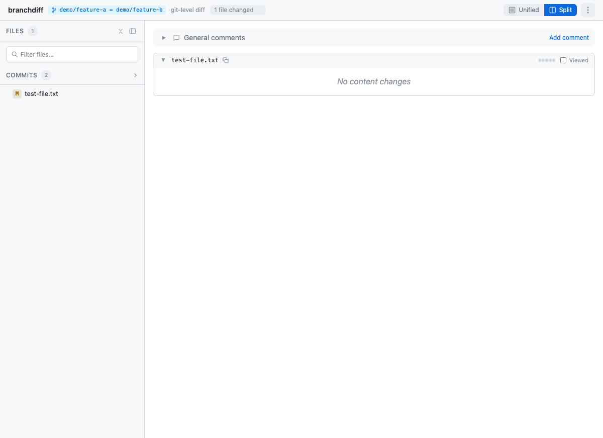

# branchdiff

Visual file-level git branch diff in your browser.

> Inspired by [Diffity](https://github.com/kamranahmedse/diffity)

## Why branchdiff?

`git diff branch1..branch2` compares **commit ancestry**, not file content. If two branches reached the same state via different histories (rebase, cherry-pick, squash), git diff shows noise.

branchdiff compares blob hashes at each branch tip — identical content is silently skipped, regardless of history.

```
main:  A → B → C → D   (file.js = "hello world")
feat:  A → X → Y       (file.js = "hello world")

git diff main..feat  →  shows diff  (wrong: different commit paths)
branchdiff main feat →  no diff     (correct: same content)
```

## Install

```bash
pnpm install
pnpm build
pnpm link --global    # makes `branchdiff` available globally
```

## Usage

```bash
branchdiff                              # all uncommitted changes
branchdiff main                         # current branch vs main
branchdiff main feat                    # branch comparison (file-level)
branchdiff main feat --mode git         # commit-level diff
branchdiff main feat --mode file        # blob hash comparison (default)
branchdiff origin/stage/prod            # remote refs supported
branchdiff main feat --dark --unified   # dark mode, unified view
branchdiff tree                         # file browser
```

### CLI flags

| Flag | Description |
|------|-------------|
| `--mode <file\|git>` | Diff mode: file (blob hashes) or git (commit ancestry) |
| `--base <ref>` | Base branch to compare from |
| `--compare <ref>` | Branch to compare against |
| `--port <port>` | Port (default: auto-assigned from 5391) |
| `--no-open` | Don't auto-open browser |
| `--dark` | Open in dark mode |
| `--unified` | Open in unified view |
| `--quiet` | Minimal terminal output |

## Features

- **File-level diff** — compares blob hashes, skips identical content
- **Git-level diff** — standard `git diff` as fallback
- **Browser UI** — React SPA with split/unified views, syntax highlighting
- **Comment system** — add review comments with severity tags (`[must-fix]`, `[suggestion]`, `[nit]`, `[question]`)
- **AI export** — export comments as JSON or Markdown for AI consumption
- **Agent API** — AI agents can post and resolve comments
- **Keyboard shortcuts** — j/k for file nav, h/l for hunk nav
- **File tree sidebar** — with status badges (A/M/D) and search filter
- **Multiple instances** — different repos on different ports
- **GitHub PR integration** — push/pull review comments to GitHub

## Branch Comparison Modes

branchdiff supports two comparison modes for branch diffs:

### File Mode (default: blob hashes)
Compares **actual file content** at each branch tip, ignoring commit history.
- Use when: branches may have diverged via rebase/cherry-pick but reached same state
- Shows files with different blob hashes only
- Perfect for: reviewing actual code changes regardless of commit ancestry

```bash
branchdiff main feat              # uses file mode by default
branchdiff main feat --mode file  # explicit file mode
```


### Git Mode (standard git diff)
Uses **commit ancestry** comparison (standard `git diff branch1..branch2`).
- Use when: you care about the commit history path between branches
- Shows what changed in the commits between branches
- Perfect for: understanding commit-level differences and PR review flow

```bash
branchdiff main feat --mode git
```



**Key Difference:**
```
Scenario: Both branches add same comment to server.ts via different commits

File mode:  No change (blob hashes identical)
Git mode:   Modified (commits differ, even though final state is same)
```

## How it works

```
git ls-tree -r branch   →  blob hash per file (fast equality check)
git show branch:path    →  file content at branch tip (no checkout needed)
diff(content_a, b)      →  unified patch → rendered in browser
```

## Architecture

pnpm monorepo with 5 packages:

```
packages/
├── cli/      CLI + HTTP server (Node, esbuild)
├── git/      Git operations (raw git CLI, no library)
├── parser/   Unified diff parser
├── github/   GitHub PR integration
└── ui/       React Router 7 SPA (Vite, TanStack Query)
```

## Development

```bash
pnpm install
pnpm build
```

## Comparison with similar tools

| Tool | Browser | File-level diff | All files | Comments |
|------|---------|----------------|-----------|----------|
| `git diff` | No | No | Yes | No |
| `diff2html-cli` | Yes | No | Yes | No |
| VSCode Compare | Yes | Yes | One at a time | No |
| **branchdiff** | Yes | Yes | Yes | Yes |

## License

MIT
